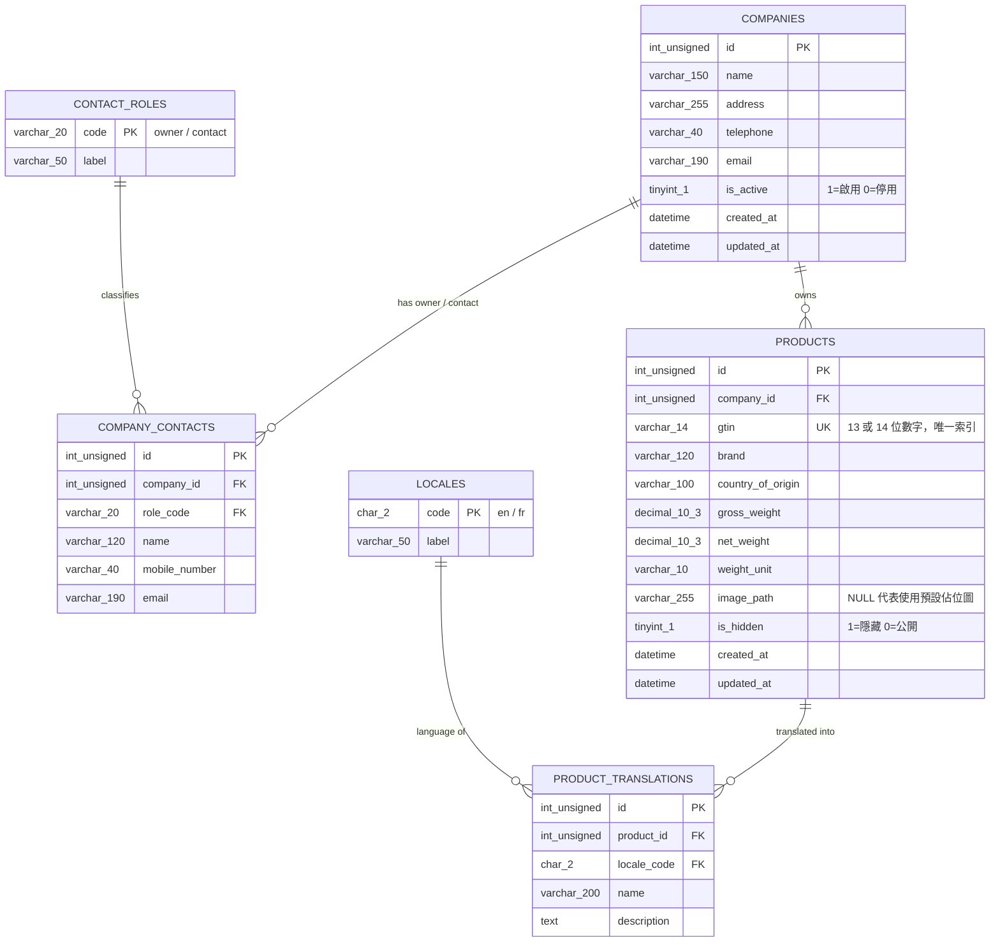

# ER 圖 / 資料庫結構說明

資料庫名稱：`worldskill2024_moduleb`
建表與測試資料：`schema.sql`

## 實體關係圖（Mermaid ER Diagram）



## 文字版關聯（給無法算繪 Mermaid 的環境）

```
contact_roles(code) 1 ────< company_contacts(role_code)
companies(id)       1 ────< company_contacts(company_id)
companies(id)       1 ────< products(company_id)
products(id)        1 ────< product_translations(product_id)
locales(code)       1 ────< product_translations(locale_code)
```

## 設計說明

| 設計 | 理由 |
| --- | --- |
| `company_contacts` 獨立成表 | 擁有者與聯絡人是同一組重複欄位（姓名／手機／Email），抽出後消除重複欄位群組，符合第三正規化，日後要加入第三種角色也不必改表結構。 |
| `product_translations` 獨立成表 | 產品的名稱與描述會隨語言變動，其餘欄位（GTIN、重量、品牌）與語言無關。拆表後新增語言只要新增資料列，不必新增欄位。 |
| `locales`、`contact_roles` 查表 | 讓 `locale_code`、`role_code` 有外鍵可以參照，避免出現無效代碼。 |
| `gtin` 使用 `UNIQUE KEY` | 同時滿足「每個產品唯一」與「GTIN 欄位建立索引」兩項要求；`VARCHAR(14)` 可保留開頭的 0（例如 `03000123456789`）。 |
| 重量使用 `DECIMAL(10,3)` | 重量需要精確的小數，`DECIMAL` 不會有浮點誤差。 |
| `is_active` / `is_hidden` 使用 `TINYINT(1)` | 布林旗標，欄位註解已寫明 1 與 0 的意義。 |
| 外鍵刪除行為 | `products.company_id` 為 `ON DELETE RESTRICT`，配合「網頁介面不可刪除公司」的要求；`product_translations`、`company_contacts` 則為 `ON DELETE CASCADE`，主資料刪除時附屬資料一併清除。 |
